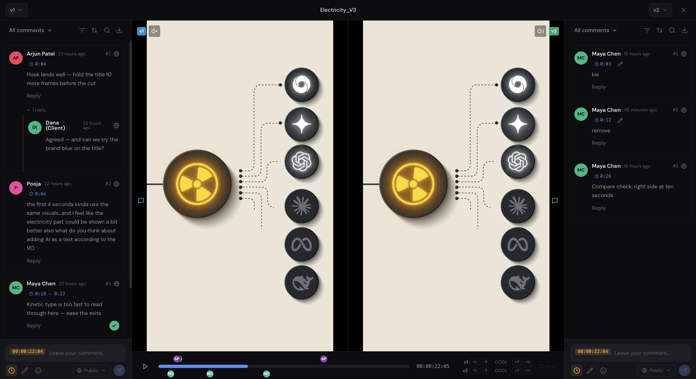
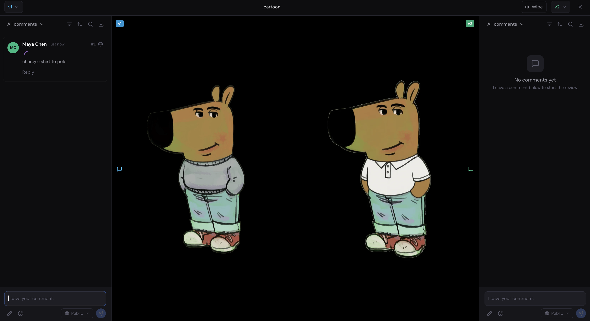
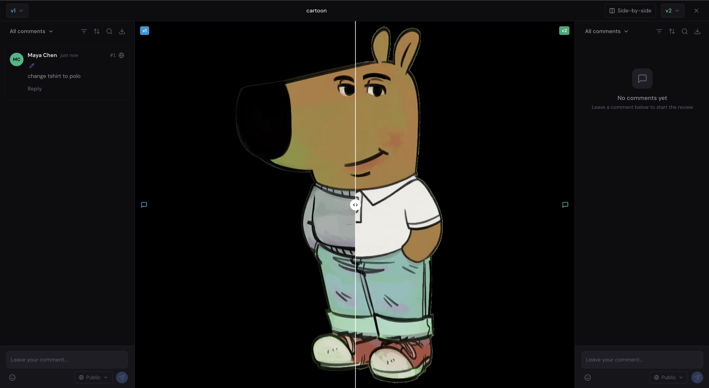
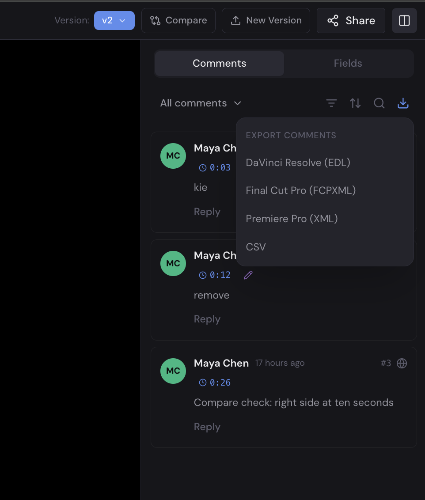

# FreeFrame

**Self-hostable, open-source media review platform. A collaborative alternative to Frame.io.**

[](https://github.com/Techiebutler/freeframe/actions/workflows/ci.yml)
[](LICENSE)
[](docker-compose.prod.yml)
[](docs/contributing.md)
[](https://github.com/Techiebutler/freeframe/discussions)

FreeFrame gives production houses and creative teams a self-hosted platform for reviewing video, image, and audio assets with frame-accurate commenting, annotations, and approval workflows. Your media stays on your infrastructure.


<p align="center"><em>Frame-accurate review: timecoded comment threads, guest replies, resolved ranges, and SMPTE timecode — on your own infrastructure.</em></p>

---

## Features

- **Video review** with HLS adaptive streaming and frame-accurate timecoded comments
- **Export comments to your NLE** — DaVinci Resolve (marker EDL), Final Cut Pro (FCPXML), Premiere Pro (XML), or CSV
- **Image and audio review** with annotations and waveform visualization
- **Drawing annotations** on any frame using canvas tools
- **Threaded comments** with mentions, reactions, and attachments
- **Approval workflows** with per-reviewer status tracking
- **Version compare** — put any two versions side-by-side or under a wipe slider, with per-version comments and annotations
- **Folder organization** within projects
- **Team collaboration** with role-based permissions (org, team, project levels)
- **Share links** for external reviewers (password-protected, expiring)
- **Guest commenting** via share links (no account required)
- **Due date tracking** with email reminders
- **Real-time updates** via Server-Sent Events
- **Self-hosted** with Docker Compose — runs on any server or cloud VM

### Compare any two versions

Put two cuts or revisions on screen at once and see exactly what changed. Video plays in frame-accurate sync with per-side audio and offset trim for re-edited cuts; images compare side-by-side or under a draggable wipe. Each version keeps its own comment thread and annotations, and the whole view is shareable by URL.



| Images side-by-side | Wipe slider |
|---|---|
|  |  |

### Take comments straight into your edit

Export a version's timecoded comments as timeline markers your editor can import — DaVinci Resolve (marker EDL), Final Cut Pro (FCPXML), Premiere Pro (XML), or CSV — so notes land on the exact frame back in the timeline.

<p align="center">
  
</p>

### Share with clients — no accounts needed

Send a link; clients review and comment without signing up. You stay in control of every link: comments/downloads permissions, passphrase, expiration date, watermarking, and appearance.

| Client view (no login) | Your share-link controls |
|---|---|
|  |  |

## Quick Start (Development)

**Prerequisites:** Docker and Docker Compose

```bash
git clone https://github.com/Techiebutler/freeframe.git
cd freeframe
cp .env.example .env
docker compose -f docker-compose.dev.yml up --build
```

Open [http://localhost:3000](http://localhost:3000) to access FreeFrame. The first user to sign up becomes the super admin.

**Services running in dev:**

| Service     | URL                          |
|-------------|------------------------------|
| Frontend    | http://localhost:3000         |
| API         | http://localhost:8000         |
| API Docs    | http://localhost:8000/docs    |
| MinIO Console | http://localhost:9001       |

## Release channels

Production self-hosters should run a **released** version, not `main`:

| Ref | What it is | Use it if… |
|-----|-----------|------------|
| `stable` | The latest release we've validated — a bad release is never promoted here. | **Production (safe default):** `git clone -b stable …`, then `git pull` to update. |
| `latest` | The newest published release (moves on every release). | You want new features sooner and can tolerate the occasional regression. |
| `v1.3.1` (any `vX.Y.Z`) | An immutable, pinned release. | You want to pin an exact version: `git checkout v1.3.1`. |
| `main` | Active development; may be unreleased or unstable. | You're developing or contributing to FreeFrame. |

Release notes are on the [Releases page](https://github.com/Techiebutler/freeframe/releases). Maintainers: see [docs/RELEASING.md](docs/RELEASING.md).

## Production Deployment

```bash
git clone -b stable https://github.com/Techiebutler/freeframe.git
cd freeframe
cp .env.example .env.prod
# Edit .env.prod — set your credentials, S3, email config
# For SSL: also set DOMAIN and ACME_EMAIL (Traefik auto-provisions Let's Encrypt certs)
docker compose --env-file .env.prod -f docker-compose.prod.yml up -d --build
```

For the full guide including **SSL setup**, **bring-your-own infrastructure** (external database, Redis, S3, SMTP), scaling, and troubleshooting, see:

**[Production Deployment Guide](docs/deployment.md)**

## Architecture

```
                    ┌──────────────┐
                    │   Traefik    │
                    │   :80/:443   │
                    └──────┬───────┘
                           │
               ┌───────────┴───────────┐
               ▼                       ▼
        ┌─────────────┐        ┌─────────────┐
        │   Next.js    │        │   FastAPI    │
        │   Frontend   │        │   Backend    │
        └─────────────┘        └──────┬───────┘
                                      │
                    ┌─────────────────┼─────────────────┐
                    ▼                 ▼                  ▼
             ┌───────────┐    ┌───────────┐     ┌───────────────┐
             │ PostgreSQL │    │   Redis    │     │  S3 Storage   │
             │            │    │           │     │ (AWS/R2/MinIO) │
             └───────────┘    └─────┬─────┘     └───────────────┘
                                    │
                         ┌──────────┴──────────┐
                         ▼                     ▼
                  ┌─────────────┐      ┌─────────────┐
                  │   Celery     │      │   Celery     │
                  │  Transcoder  │      │   Email      │
                  └─────────────┘      └─────────────┘
```

## Tech Stack

| Component    | Technology                                       |
|--------------|--------------------------------------------------|
| Frontend     | Next.js 14, React 18, Tailwind CSS, Zustand      |
| Backend      | FastAPI, SQLAlchemy, Pydantic                    |
| Database     | PostgreSQL 15                                     |
| Queue        | Celery + Redis                                    |
| Transcoding  | FFmpeg (multi-bitrate HLS)                        |
| Storage      | Any S3-compatible (AWS, R2, B2, MinIO)           |
| Proxy        | Traefik (auto SSL via Let's Encrypt)              |
| Auth         | JWT + magic code email login                      |

## Documentation

| Guide | Description |
|-------|-------------|
| [Production Deployment](docs/deployment.md) | SSL, bring-your-own infra, scaling, troubleshooting |
| [Architecture](docs/architecture.md) | System design, data flow, media pipeline, permissions |
| [Contributing](docs/contributing.md) | Dev setup, testing, code style, PR process |
| [Environment Variables](.env.example) | Full config reference with comments |

## Contributing

We welcome contributions of every kind — **not just code**. Testing a release against your NLE and reporting what you find, improving docs, filing detailed bug reports, and suggesting workflow features from real production experience all move FreeFrame forward.

- Read the [Contributing Guide](docs/contributing.md) for dev setup and conventions
- Grab a [`good first issue`](https://github.com/Techiebutler/freeframe/issues?q=is%3Aissue+is%3Aopen+label%3A%22good+first+issue%22) to make your first PR
- Ask questions or propose ideas in [Discussions](https://github.com/Techiebutler/freeframe/discussions)

We aim to respond to new issues and PRs **within 48 hours**.

## License

MIT License — see [LICENSE](LICENSE) for details.

---

## Contact & Support

<div align="center">

**A project by [Techiebutler](https://techiebutler.com)**

Have questions? Need help?

**Email:** [support@techiebutler.com](mailto:support@techiebutler.com)

[](https://www.instagram.com/techie_butler/)
[](https://www.linkedin.com/company/techiebutler/)

Star the repo if FreeFrame is useful to you!

</div>
